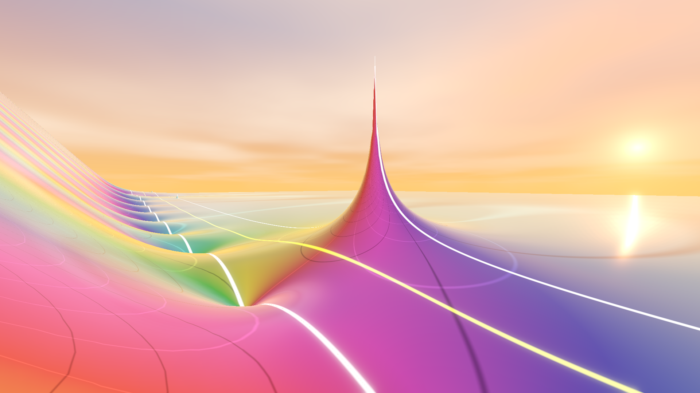

# Complex Functions Explorer

  

**Complex Functions Explorer** is an interactive 3D visualization tool that brings the abstract beauty of complex analysis to life. By mapping complex numbers into a navigable three-dimensional landscape, the software allows users to explore the intricate structures of functions such as the Riemann zeta function, including zeros, poles, and the critical line, within an immersive environment.

## Features

### Domain Coloring
The explorer uses **domain coloring** to visualize complex-valued functions. Each point in the complex plane is assigned a color according to the phase (argument) of the function, while the magnitude determines the height of the terrain.

*   **Phase to Color:** The color cycle represents the angle of the complex value.
*   **Magnitude to Height:** Peaks and valleys represent high and low magnitudes, respectively. Zeros are visible as deep pits that reach the "floor" of the domain.

  
  

### Supported Functions
The explorer supports various standard complex functions, including trigonometric, exponential, and logarithmic functions. The centerpiece is the **Riemann zeta function** $\zeta(s)$.

#### The Riemann Zeta Function
Implementation uses the **Dirichlet Eta representation** for numerical stability:
$$\zeta(s) = \frac{1}{1 - 2^{1-s}} \sum_{n=1}^\infty \frac{(-1)^{n-1}}{n^s}$$
This allows evaluation across the critical strip, essential for visualizing the region related to the Riemann Hypothesis.

## Technical Details

Built with the **Godot Engine**, the project leverages modern rendering and audio techniques:

*   **GPU Shaders:** Terrain displacement and domain coloring are handled via GLSL shaders for high-performance real-time visualization.
*   **Spatial Audio:** A topographic drone responds to terrain height and phase, providing an auditory dimension to the mathematical exploration.
*   **Dynamic World:** Features a day/night cycle, golden hour transitions, and customizable rendering modes (Estimated vs. Precise shading).

## Controls

*   **Movement:** `W`, `A`, `S`, `D` keys.
*   **Elevation:** `Space` (Double-press to reset height).
*   **Sprint:** Hold `Shift`.
*   **Slow Walk:** Hold `Ctrl`.
*   **Menu:** `Esc` to toggle settings.
*   **Automatic Walking:** `Ctrl + C` (when viewing the Zeta function) to walk along the critical line.

## License

This project is licensed under the MIT License - see the [LICENSE](LICENSE) file for details.
