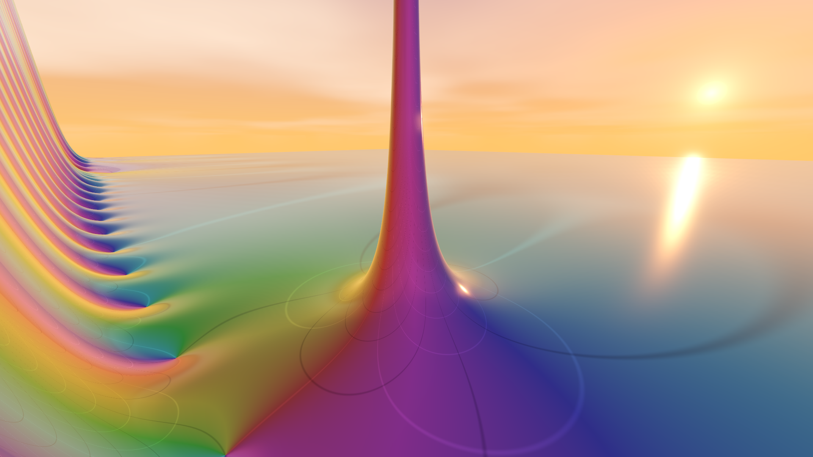
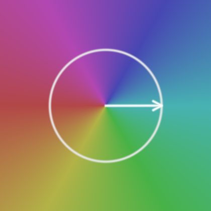
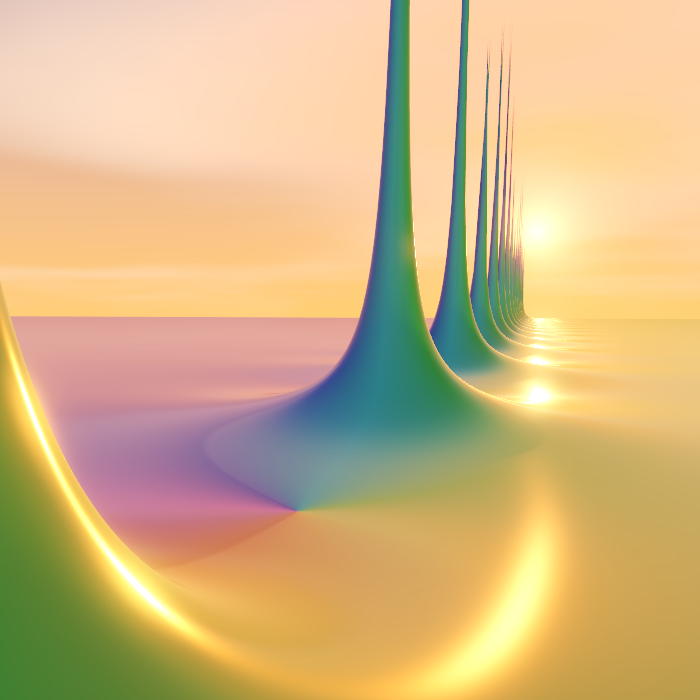
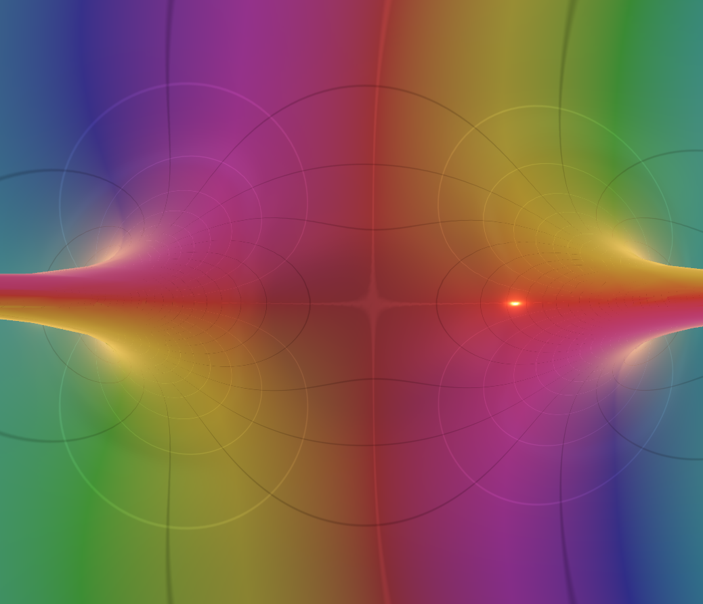
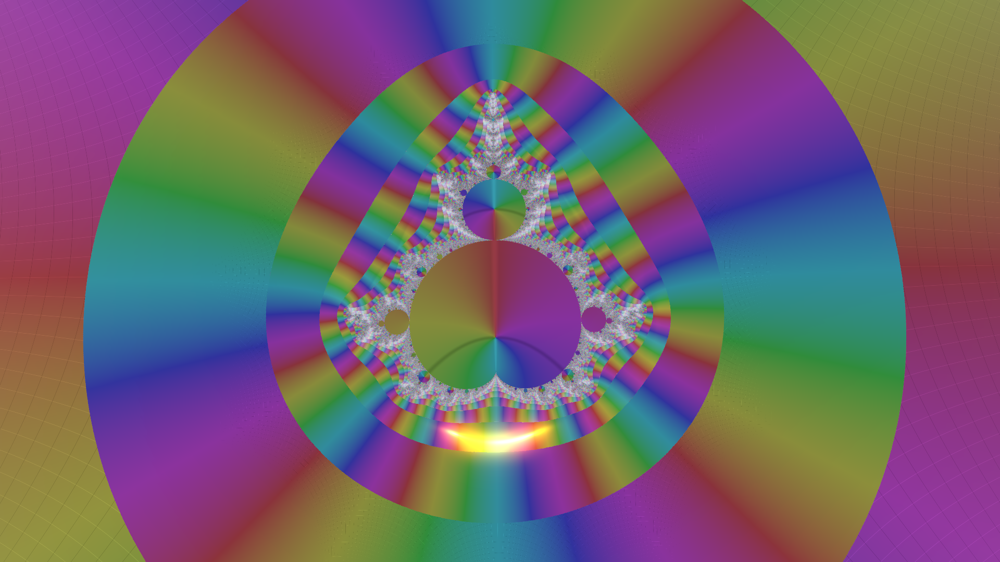
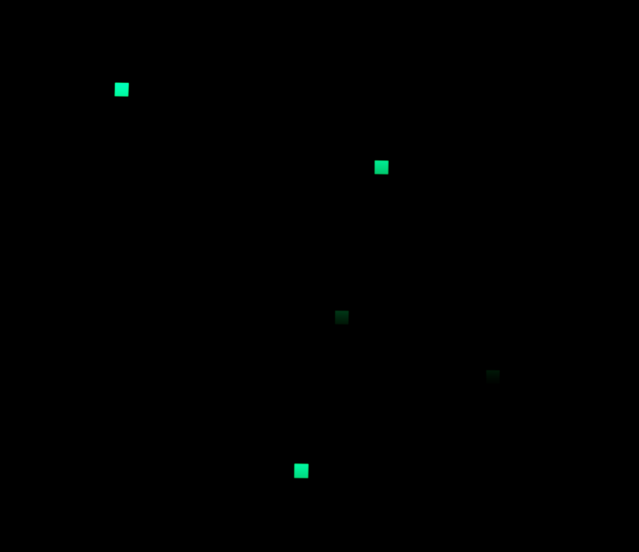

# Complex Functions Explorer

  

**Complex Functions Explorer** is an interactive 3D visualization tool that brings the abstract beauty of complex analysis to life. By mapping complex numbers into a navigable three-dimensional landscape, the software allows users to explore the intricate structures of functions such as the Riemann zeta function, including zeros, poles, and the critical line, within an immersive environment.

Whether you are a student of mathematics, a researcher, or simply someone who appreciates the visual elegance of mathematical structures, this tool provides a unique perspective on how complex functions transform and shape the complex plane.

The project is intended not only as a mathematical visualization tool, but also as an invitation to contemplate the hidden geometries of the complex plane.

## Features

### Domain Coloring
The explorer uses **domain coloring** to visualize complex-valued functions. Each point in the complex plane is assigned a color according to the phase (argument) of the function, while the magnitude determines the height of the terrain.

*   **Phase to Color:** The color cycle (typically a rainbow or HSV wheel) represents the angle of the complex value. Purely real positive values are often mapped to green, while purely imaginary positive values map to purple, and so on.
*   **Magnitude to Height:** Peaks and valleys represent high and low magnitudes, respectively. This makes zeros clearly visible as deep pits that reach the "floor" of the domain.

  
  

### Curve Levels

Superimposed on the terrain are contour lines, or **curve levels**, which provide a geometric reference for the values of the function. These curves make it possible to trace how the real and imaginary components evolve across the complex plane.

*   **Black Curves (Real Part):** These correspond to level sets where the real part of the function takes integer values. They reveal the underlying structure of the function’s real transformation.
    
*   **White Curves (Imaginary Part):** These correspond to level sets where the imaginary part takes integer values. Together with the black curves, they form a curvilinear grid that reflects the conformal character of the mapping.

  

When a black curve and a white curve intersect at the base of the terrain, the point may correspond to a **zero** of the function, where both the real and imaginary parts vanish simultaneously.

### Supported Functions
The explorer supports various standard complex functions, including trigonometric, exponential, and logarithmic functions. The centerpiece is the **Riemann zeta function** $\zeta(s)$.

#### The Riemann Zeta Function

##### Eta function analytical continuation
Implementation uses the **Dirichlet Eta representation** for numerical stability when $\mathrm{Re}(s) > 0.5$:
$$\zeta(s) = \frac{1}{1 - 2^{1-s}} \sum_{n=1}^\infty \frac{(-1)^{n-1}}{n^s}$$

##### Reflection formula analytical continuation
For $\mathrm{Re}(s) < 0.5$, the explorer utilizes the **reflection formula** to achieve analytical continuation to the entire complex plane:
$$\zeta(s) = 2^s \pi^{s-1} \sin\left(\frac{\pi s}{2}\right) \Gamma(1-s) \zeta(1-s)$$
In this calculation, the term $\zeta(1-s)$ is evaluated using the Dirichlet Eta representation, since for $\mathrm{Re}(s) < 0.5$, the reflected point $1-s$ has a real part greater than $0.5$. This allows evaluation across the critical strip and beyond.

> **Note on Precision:** Calculations are performed in GPU shaders using `float32` arithmetic. This introduces numerical limitations and potential artifacts as the magnitude of the imaginary part $|t|$ increases, due to the rapid oscillation and large intermediate values of the functions involved. These effects are especially pronounced in the $\sin$ and $\Gamma$ terms of the reflection formula, both of which can grow rapidly in magnitude.

#### The Dirichlet Beta Function
The explorer implements the **Dirichlet beta function** $\beta(s)$ using its series representation, which converges for $\mathrm{Re}(s) > 0$:
$$\beta(s) = \sum_{n=0}^\infty \frac{(-1)^n}{(2n+1)^s}$$

#### The Gamma Function
The Gamma function $\Gamma(z)$ is implemented using the **Lanczos approximation** ($g=7, N=9$):
$$\Gamma(z) \approx \sqrt{2\pi} (z+g-0.5)^{z-0.5} e^{-(z+g-0.5)} A_g(z-1)$$
where $A_g(z)$ is the partial fraction expansion:
$$A_g(z) = p_0 + \sum_{n=1}^8 \frac{p_n}{z+n}$$
using the following coefficients:
* $p_0 = 0.99999999999980993$
* $p_1 = 676.5203681218851$
* $p_2 = -1259.1392167224028$
* $p_3 = 771.32342877765313$
* $p_4 = -176.61502916214059$
* $p_5 = 12.507343278686905$
* $p_6 = -0.13857109526572012$
* $p_7 = 9.9843695780195716 \times 10^{-6}$
* $p_8 = 1.5056327351493116 \times 10^{-7}$

#### The Mandelbrot Function
The explorer visualizes the **Mandelbrot function** by computing the sequence $z_{n+1} = z_n^2 + c$ recursively, starting at $z_0 = 0$, where $c$ represents the position in the complex plane. The `iterations` parameter controls the maximum depth of the recursion. The final value of $z_n$ is used for domain coloring and height mapping.

  

> ** Using the Zoom Factor: ** The `Zoom Factor` controls the scale of the visible region in the complex plane. Larger zoom values progressively magnify smaller portions of the function, revealing increasingly intricate structures and fine details that are not visible at larger scales. As the zoom increases, the explorer rescales the domain coordinates before evaluating the function. This effectively allows navigation through smaller regions of the complex plane while preserving the same rendering pipeline. In the Mandelbrot visualization, deep zooms expose self-similar formations, filamentary boundaries, and highly complex recursive structures characteristic of fractal geometry.

### Numerical Singularities
Regions where the function evaluation produces `NaN` or infinite values are rendered as a dark terrain covered with green grid-like squares reminiscent of *The Matrix*. These regions typically arise near overflow conditions, or severe floating-point instability in the GPU shaders. Rather than hiding such failures, the visualization exposes them directly as part of the numerical structure of the computation.

  

## Technical Details

Built with the **Godot Engine**, the project leverages modern rendering and audio techniques:

*   **GPU Shaders:** Terrain displacement and domain coloring are handled via GLSL shaders for high-performance real-time visualization.
*   **Spatial Audio:** A topographic drone responds to terrain height and phase, providing an auditory dimension to the mathematical exploration.
*   **Dynamic World:** Features a day/night cycle, adjustable sunrise direction, and multiple environmental lighting modes.

## Options
Pressing the **Esc** key opens the settings menu, providing several ways to customize your experience:

*   **Function:** Select complex functions (Zeta, Gamma, Dedekind Eta, etc.), choose height mapping (Logarithmic or Absolute), and configure parameters like iterations or rational expressions.
*   **Environment:** Customize visual themes (Color Scheme), toggle level curves and the critical stripe, and control the sun position and sunrise direction.
*   **Graphics:** Fine-tune rendering quality, including terrain detail, antialiasing modes (MSAA, FXAA, SMAA), view distance, and shadows.
*   **Navigation:** Set precise coordinates (Real/Imaginary), adjust movement speed and camera height, and toggle automatic walking along the critical line.
*   **HUD:** Customize on-screen information, such as the complex plane overlay, navigation data, and zeta zero detection panels.
*   **Audio:** Manage volume levels for the background music and the terrain-responsive topographic drone.

## Controls

*   **Movement:** `W`, `A`, `S`, `D` keys.
*   **Elevation:** `Space` (Double-press to reset height).
*   **Sprint:** Hold `Shift`.
*   **Slow Walk:** Hold `Ctrl`.
*   **Menu:** `Esc` to toggle settings.
*   **Automatic Walking:** `Ctrl + C` (when viewing the Zeta function) to walk along the critical line.

## License

This project is licensed under the MIT License - see the [LICENSE](LICENSE) file for details.
