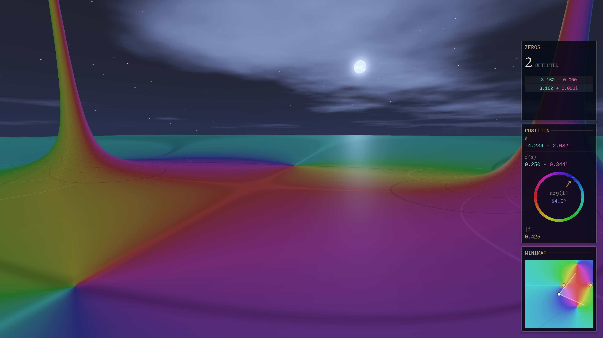

# Complex Functions Explorer

<p align="center">
  
</p>

**Complex Functions Explorer** is an interactive 3D visualization tool for exploring complex analysis through immersive landscapes.
Navigate functions such as the Riemann zeta function and discover zeros, poles, critical structures,
and transformations directly in the complex plane.

Designed for students, researchers, and the mathematically curious, it offers an intuitive way to
experience the geometry hidden inside complex functions.

Check the [web page](https://allanino.github.io/complex-functions-explorer/) and the [docs](https://allanino.github.io/complex-functions-explorer/docs) for more details.

## Highlights

* Explore complex functions in real time as immersive 3D landscapes.
* Visualize function values using color for phase and terrain height for magnitude.
* Navigate the complex plane freely with smooth first-person camera controls.
* Discover zeros, poles, and critical structures.
* Explore the Riemann zeta function and its hidden geometry.
* Use the minimap to orient yourself across the complex plane.
* Adjust function parameters and watch the landscape transform instantly.
* Navigate between branches of multivalued functions through immersive portals.
* Customize environment, colors and rendering options.

<p align="center">
  
</p>

## Technical Details

Built with the **Godot Engine**, the project leverages modern rendering and audio techniques:

*   **GPU Shaders:** Terrain displacement and domain coloring are handled via GLSL shaders for high-performance real-time visualization.
*   **Spatial Audio:** A topographic drone responds to terrain height and phase, providing an auditory dimension to the mathematical exploration.
*   **Dynamic World:** Features a dynamic day/night cycle with customizable duration, a static time mode, and adjustable sunrise direction.

## Options
Pressing the **Esc** key opens the settings menu, providing several ways to customize your experience:

*   **Function:** Select complex functions (Zeta, Gamma, Dedekind Eta, etc.), choose height mapping (Logarithmic or Absolute), and configure parameters like iterations or rational expressions.
*   **Environment:** Customize visual themes (Color Scheme), toggle level curves and the critical stripe, and control the time of day (**Freeze time** toggle) with precise duration and time settings.
*   **Graphics:** Fine-tune rendering quality, including terrain detail, antialiasing modes (MSAA, FXAA, SMAA), view distance, and shadows.
*   **Navigation:** Set precise coordinates (Real/Imaginary), adjust movement speed and camera height, and toggle automatic walking along the critical line.
*   **HUD:** Customize on-screen information, such as the complex plane overlay, navigation data, and zeta zero detection panels.
*   **Audio:** Manage volume levels for the background music and the terrain-responsive topographic drone.

## Controls

*   **Movement:** `W`, `A`, `S`, `D` keys.
*   **Elevation:** `Space` (Double-press to reset height).
*   **Sprint:** Hold `Shift`.
*   **Slow Walk:** Hold `Ctrl`.
*   **Menu:** `Esc` to toggle settings.
*   **Automatic Walking:** `Ctrl + C` (when viewing the Zeta function) to walk along the critical line.

## Development

### Building the GDExtension (C++)

This project uses **GDExtension + godot-cpp + SCons**.

#### First-time setup

Clone submodules:

```bash
git submodule update --init --recursive
```

Build `godot-cpp` bindings and static library:

```bash
cd godot-cpp
scons platform=linux target=template_debug generate_bindings=yes
cd ..
```

Build the extension:

```bash
scons platform=linux target=template_debug
```

This should generate:

```text
bin/libcomplex_functions.linux.template_debug.x86_64.so
```

#### Development workflow

Whenever a `.cpp` or `.h` file changes:

```bash
scons platform=linux target=template_debug
```

SCons rebuilds incrementally (only changed files).

Then reload the Godot project if changes do not appear.

#### Exporting release builds

Before exporting:

```bash
scons platform=linux target=template_release
```

This generates:

```text
bin/libcomplex_functions.linux.template_release.x86_64.so
```

Godot automatically loads:

* `*.debug.*` → Editor + Debug exports
* `*.release.*` → Release exports

No manual switching required.

### Common problems

#### Missing GDExtension library

Error:

```text
GDExtension dynamic library not found
```

Check:

* `godot-cpp/` exists
* `godot-cpp` was built
* `bin/*.so` exists
* paths match `complex_functions.gdextension`

#### Fresh clone fails

Run:

```bash
git submodule update --init --recursive
```

to fetch `godot-cpp`.

## License

This project is licensed under the MIT License - see the [LICENSE](LICENSE) file for details.
